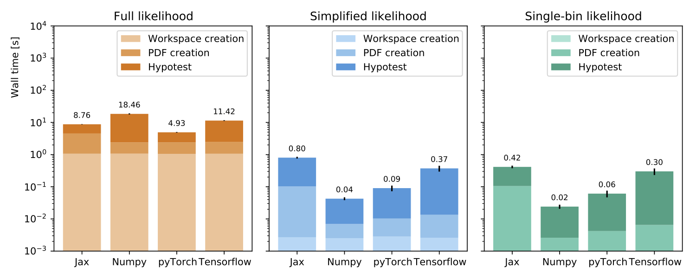
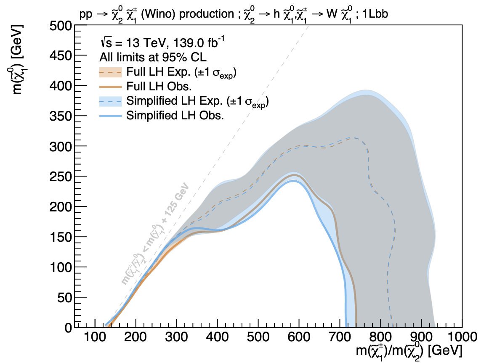

# simplify

[](https://github.com/eschanet/simplify/actions?query=workflow%3ACI)
[](https://codecov.io/gh/eschanet/simplify)
[](https://badge.fury.io/py/simplify)
[](https://pypi.org/project/simplify/)
[](https://github.com/psf/black)


A python package that creates simplified likelihoods from full likelihoods. The method is documented in the ATLAS PUB note [Implementation of simplified likelihoods in HistFactory for searches for supersymmetry](https://cds.cern.ch/record/2782654) and in [chapter 10 of Eric Schanet's PhD thesis](https://cds.cern.ch/record/2774438/files/CERN-THESIS-2021-077.pdf). Currently, only one format is implemented for simplified likelihoods, but the idea is to support additional forms of (not so) simplified likelihoods.

## Table of contents

1. [Introduction](#introduction)
2. [Installation](#installation)
3. [How To Run](#how-to-run)
4. [Example Likelihood](#example-likelihood)


## Introduction

In high energy physics (HEP), searches for new physics are typically interested in making inferences about a probabilistic model given some observed collision data. This approach can be formalised using a *statistical model* <i>f(<b>x</b>&VerticalLine;<b>&phi;</b>)</i>, i.e. a parametric family of probability density functions (PDFs) describing the probability of observing data <i><b>x</b></i> given some model parameters <i><b>&phi;</b></i>. The *likelihood function* <i>L(<b>&phi;</b>)</i> then refers to the value of *f* as a function of <i><b>&phi;</b></i> given fixed <i><b>x</b></i>.

For binned data, the [HistFactory](https://cds.cern.ch/record/1456844?ln=de) template for building statistical models and likelihoods finds ample usage in HEP.

Although many searches for supersymmetry (SUSY) are sensitive to a variety of beyond the Standard Model (BSM) physics models, for reasons of computational cost and complexity they are often only interpreted in a limited set of *simplified models*. While statistical inference and interpretation of limits on individual SUSY production and decay topologies is straightforward and very convenient, their lack of model complexity leads to poor approximations to the true underlying constraints on the respective model parameters of a more complete SUSY model. In order to investigate realistic SUSY scenarios, large-scale re-interpretation efforts scanning a large number of dimensions is needed, resulting in a significant increase in computational cost for the statistical inference.

The approximation method put forward in the ATLAS PUB note [Implementation of simplified likelihoods in HistFactory for searches for supersymmetry](https://cds.cern.ch/record/2782654) and implemented in this repository introduces the notion of *simplified likelihoods* that come with low computational cost but high statistical precision, therefore offering a viable solution for large-scale re-interpretation efforts over large model spaces.


## Installation

Follow good practice and start by creating a virtual environment, e.g. using `venv`

```console
python3 -m venv simplify
```

and then activating it
```console
source simplify/bin/activate
```

### Default installation from PyPI

You can install `simplify` directly from PyPI with
```console
python3 -m pip install simplify[contrib]
```

Notice that `simplify` is supported and tested for `python 3.7` and `python 3.8`.

### Development installation

If you want to contribute to `simplify`, install the development version of the package. Fork the repository, clone your fork, and then install from local resources with
```console
python3 -m pip install --ignore-installed -U -e .[complete]
```
Note that you might have to wrap `.[complete]` into quotes depending on your shell.

Next, setup the git pre-commit hook for Black
```console
pre-commit install
```

Now you should be able to run all the tests with
```console
python3 -m pytest
```

## How to run

You can use `simplify` either through your command line, or integrate it directly into your scripts.

### CLI

Run with e.g.

```console
simplify convert < fullLH.json > simplifiedLH.json
```

or e.g.

```console
curl http://foo/likelihood.json | simplify convert
```

where `fullLH.json` is the full likelihood you want to convert into a simplified likelihood. Simplify is able to read/write from/to stdin/stdout.

Hit `simplify --help` for detailed information on the CLI.

### In Python script

You can also use `simplify` in a Python script, e.g. to create some validation and cross-check plots and tables.

```py
import pyhf
import json

import simplify

# set the computational backend to pyhf and load LH
pyhf.set_backend(pyhf.tensorlib, "minuit")
spec = json.load(open("likelihood.json", "r"))

# ws from full LH
ws = pyhf.Workspace(spec)

# get model and data for each ws we just created
# use polynomial interpolation and exponential extrapolation
# for nuisance params
model = ws.model(
    modifier_settings = {
        "normsys": {"interpcode": "code4"},
        "histosys": {"interpcode": "code4p"},
    }
)
data = ws.data(model)

# run fit
fit_result = simplify.fitter.fit(ws)

# plot the pulls
plt = simplify.plot.pulls(
    fit_result,
    "plots/"
)

# plot correlation matrix
plt = simplify.plot.correlation_matrix(
    fit_result,
    "plots/",
    pruning_threshold=0.1
)

# get a yieldstable in nice LaTeX format
tables = simplify.plot.yieldsTable(
    ws,
    "plots/",
    fit_result,
)
```

## Example Likelihood

Let's go through an example likelihood. We'll use the full likelihood of an ATLAS search for direct production of electroweakinos in final states with one lepton and a Higgs boson ([10.1140/epjc/s10052-020-8050-3](https://arxiv.org/abs/1909.09226)). The full likelihood in `JSON` format as specified by [ATL-PHYS-PUB-2019-029](https://cds.cern.ch/record/2684863) is publicly available to download from [doi.org/10.17182](https://www.hepdata.net/record/resource/1408476?view=true). It contains the full statistical model of the original analysis given the full observed dataset from Run-2 of the LHC.

You can either download the likelihood by hand from [HEPData](https://www.hepdata.net/record/resource/1408476?view=true), or just let `pyhf` do the work for you by using
```console
pyhf contrib download https://doi.org/10.17182/hepdata.90607.v3/r3 1Lbb-likelihoods && cd 1Lbb-likelihoods
```

From there, provided you have already setup `simplify` previously (which also sets up `pyhf`), you can produce a simplified likelihood of this analysis with
```console
simplify convert < BkgOnly.json > simplify_BkgOnly.json
```

And you're done. Well, at least you've got yourself a simplified version of that likelihood, which approximates the total background using a single background sample that is set to the post-fit total background determined from the full likelihood. The uncertainties (the expensive part) are approximated using only the final uncertainty on the background estimate in each bin of the analysis.

If you think about it, this gives you quite a simple likelihood function. Let's compare them quickly. For the full likelihood, we can inspect the full likelihood with `pyhf` (and only look at the first 17 lines containing summary of what `pyhf` spits out):
```console
pyhf inspect BkgOnly.json | head -n 17
```

This should give you
```console
       Summary
  ------------------
    channels  8
     samples  9
  parameters  115
   modifiers  115

    channels  nbins
  ----------  -----
 SRHMEM_mct2    3
 SRLMEM_mct2    3
 SRMMEM_mct2    3
 STCREM_cuts    1
 TRHMEM_cuts    1
 TRLMEM_cuts    1
 TRMMEM_cuts    1
   WREM_cuts    1
```

Think about this for a second. You've got 8 channels with a total of 14 bins. Each bin contains information about 9 samples, and each event rate for each sample is subject to a total of 115 additional parameters (the uncertainties of the model). This makes for quite a complicated likelihood function.

On to the simplified one then.
```console
pyhf inspect simplify_BkgOnly.json | head -n 17
```
gives us
```console
       Summary
  ------------------
    channels  8
     samples  1
  parameters  1
   modifiers  1

    channels  nbins
  ----------  -----
 SRHMEM_mct2    3
 SRLMEM_mct2    3
 SRMMEM_mct2    3
 STCREM_cuts    1
 TRHMEM_cuts    1
 TRLMEM_cuts    1
 TRMMEM_cuts    1
   WREM_cuts    1
```
i.e, we still have the original number of bins and samples (this is what drives our sensitivity, so we don't want to compromise here), but we end up with only one sample and one uncertainty per bin.

It's not surprising to see then, that the computational performance of both is quite different. Let's have a look at a benchmark for this specific analysis:



Ignore the green bars for now and focus on the orange and blue ones instead. The orange (blue) ones show the wall times in seconds for the full (simplified) likelihood. In their fastest configurations, the simplified likelihood obviously is two orders of magnitude faster than the full likelihood.

But this isn't worth anything if the approximation isn't a good one. So let's have a look at how it performs. All the original signal models investigated by the analysis are contained in the `1Lbb-likelihoods` as a `JSON` patch file. Just patch each one onto the full and simplified likelihood, perform statistical inference using `pyhf` and then plot the results:



Given the two orders of magnitude we gain in computational speed, this small loss in statistical precision is impressive! Within the one standard deviation uncertainties, there is basically no difference at all in both contours!

P.S. I skipped quite a few steps to get to this figure. All of the necessary tools and scripts are available (and sometimes described) in my [pyhf_inference_tools](https://github.com/eschanet/pyhf_inference_tools).
